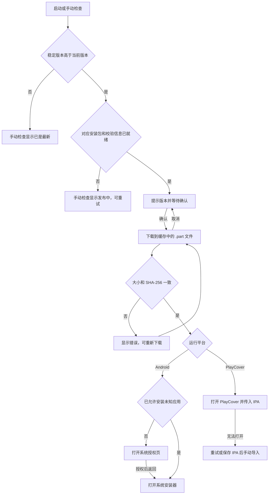

# 应用更新与发布签名

Vesper 从 `umbrella22/Vesper-Player-Demo` 的 GitHub 最新稳定 Release 检查更新。
Android ARM64 下载 APK 并打开系统安装器；PlayCover 下载专用 IPA 并尝试交给
PlayCover 安装。普通 iPhone、iPad 不提供此安装入口。

## 运行流程

应用每次启动检查一次。仅在安装包已就绪、首页仍在前台时弹出新版本提示；
网络失败、没有更新或用户已经进入播放等其他页面时不弹窗。
App 设置页与 TV 模式的关于区域提供手动检查入口。

用户确认后才开始下载。更新弹窗展示版本、发布说明、下载进度，并支持取消。
安装包通过字节数和 SHA-256 校验后才交给原生安装桥接。

`handedOff` 表示已打开安装程序，安装是否成功由平台决定。用户在系统安装界面
取消后，可以从更新弹窗再次打开安装程序，无需重新下载。PlayCover 也提供
“保存安装包”入口。

## GitHub Release 契约

- 使用 `/repos/umbrella22/Vesper-Player-Demo/releases/latest`，不携带账号凭证或
  Bilibili cookie。请求受限或网络异常时可手动重试。
- 识别 `vesper_media-v<version>` 与历史 `v<version>` 标签，跳过草稿和预发布。
  按语义版本比较，忽略 `+build` 元数据，不依据 Release 标题或发布时间排序。
- 安装包名称必须与版本和平台精确匹配；下载地址必须属于该仓库和标签。
- GitHub 资产的 `digest` 提供 SHA-256；缺失时使用同名 `.sha256` 附件。
  校验文件格式为 `<sha256>  <安装包文件名>`，文件名必须匹配。
- 最新 Release 发布后，两个平台的流水线可能尚未完成。缺少相应安装包或校验
  信息时进入 `publishing`，不下载其他平台或旧版本的附件。

| 平台 | 安装包名称 |
| --- | --- |
| Android ARM64 | `vesper-v<version>-android-arm64-release.apk` |
| PlayCover | `vesper-v<version>-ios-playcover.ipa` |

`*-ios-unsigned.ipa` 用于开发者重签，不参与 PlayCover 自动更新。

## 平台安装边界

Android 原生桥接只接受应用缓存 `vesper-updates/` 中的 APK，并检查包名、
`versionCode` 和签名兼容性。`versionCode` 沿用 Flutter 构建值，不能低于已安装
版本；应用内的新版本判断使用 `versionName`。通过检查后，FileProvider 仅授权
安装器读取该文件。首次安装可能需要授予“安装未知应用”权限；返回应用后自动
继续打开系统安装器，最终安装仍需用户确认。

PlayCover 运行环境通过 `isiOSAppOnMac` / `isMacCatalystApp` 判断。
原生桥接在 macOS 上动态解析公开的 `NSWorkspace` API，查找
`io.playcover.PlayCover` 并将本地 IPA 交给它的文件处理入口。
其自定义 URL scheme 不提供安装操作。运行环境无法打开 PlayCover 时，保留已
下载的 IPA，通过系统文件导出窗口保存，再由用户导入 PlayCover。

## Android 固定发布签名

Release 构建必须提供专用发布签名；缺少配置时构建失败。Debug/Profile 保持各自
的开发构建配置。CI 从 GitHub Actions Secrets 恢复 PKCS12 文件到 runner 临时
目录，构建完成后删除临时密钥文件。

| GitHub Actions Secret | App Gradle 环境变量 |
| --- | --- |
| `ANDROID_RELEASE_KEYSTORE_BASE64` | 解码文件的绝对路径写入 `VESPER_ANDROID_KEYSTORE_PATH` |
| `ANDROID_RELEASE_STORE_PASSWORD` | `VESPER_ANDROID_STORE_PASSWORD` |
| `ANDROID_RELEASE_KEY_ALIAS` | `VESPER_ANDROID_KEY_ALIAS` |
| `ANDROID_RELEASE_KEY_PASSWORD` | `VESPER_ANDROID_KEY_PASSWORD` |

本地 Release 构建同样从这四项 `VESPER_ANDROID_*` 环境变量读取配置。
发布密钥及密码保存在仓库之外，备份需要同时包含密钥文件和密码。
GitHub Secrets 无法导出已写入的原始值，不能替代本地密钥备份。

旧发布流程使用构建机的临时 Debug 签名，无法与新的固定发布签名覆盖兼容。
从旧签名切换到新签名需要一次手动迁移；卸载旧应用会影响本地账号、缓存及设置。
更新器遇到签名不匹配会停止安装，不会自动卸载应用。使用新签名安装后，后续
Release 沿用同一密钥即可覆盖更新。

## 组件与验证

`lib/app/updates/` 分别处理 Release 解析、独立 HTTP 下载、更新状态及弹窗。
`PlatformApp` 创建并注入同一个 `AppUpdateController`，启动检查与设置入口共享
状态，避免重复下载或重复弹窗。原生桥接只处理平台识别、安装及导出。

下载文件位于 `path_provider` 临时目录的 `vesper-updates/` 子目录；只有校验完成
才从 `.part` 重命名为最终文件。检查状态、下载进度和安装交接状态保存在内存中，
不跨应用重启恢复任务。取消或失败时清理本次部分下载。

`test/app_update_test.dart` 验证版本、附件选择与状态转换；
`test/app_update_download_test.dart` 使用本地 HTTP 服务验证真实流式下载、校验和取消；
`test/app_update_widgets_test.dart` 验证用户确认、静默启动检查与安装重试交互。
原生变更还需要通过 App Android wrapper 构建和
`bash scripts/build_ios_no_codesign.sh release`，并在相应设备上验证系统安装交接。
