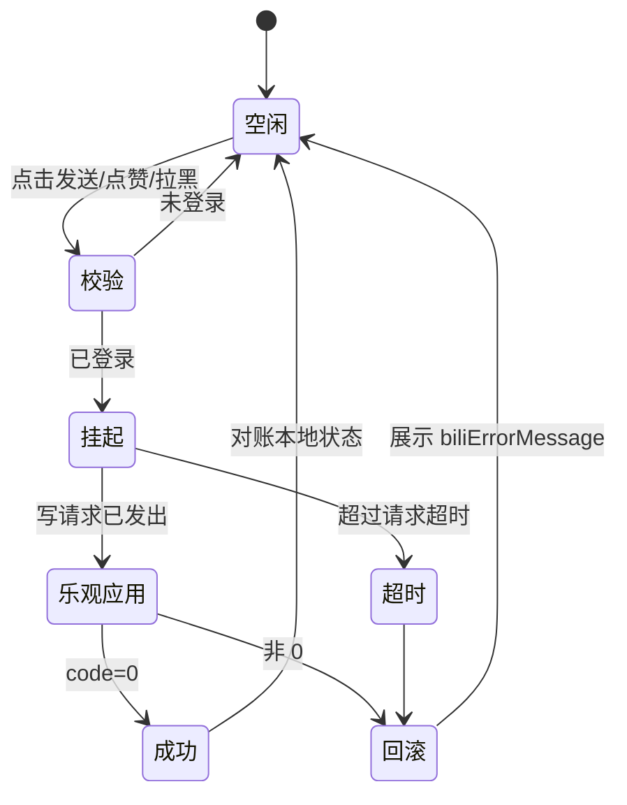

# Bilibili 弹幕互动与评论点赞接口

弹幕发送、弹幕点赞、用户屏蔽与评论点赞是改变服务端状态的写操作。这四条链路与已有的
读取链路（`/x/v2/dm/web/seg.so`、`/x/v2/reply`、`/x/v2/dm/web/view`）共用 `BiliTransport`
的登录态判定、`csrf` 注入与风控错误映射，差别在于：读链路失败只影响当前画面，写链路
失败必须回滚本地状态，否则界面会显示一个服务端并不存在的状态。

写链路的前置条件统一为 `BiliTransport.hasAuthenticatedSession`，即 `SESSDATA` 与
`bili_jct` 同时存在（`lib/bili/common/services/bili_transport.dart:38-40`）。

## 1. 证据等级

社区 API 参考仓库 `SocialSisterYi/bilibili-API-collect` 已于 2026-01 关停并删除文档，
外部契约来源不可引用。证据只来自本仓库自身的调用记录，每个端点按以下等级标注：

| 等级 | 含义 | 处理方式 |
| --- | --- | --- |
| 已验证 | 本仓库已有生产调用，行为由测试锁定 | 可直接复用同族代码 |
| 同族 | 请求/响应信封与已验证端点同族，参数命名一致 | 实现时按已验证端点的读写方式编码 |
| 待实测 | 路径存在多形态，或参数集合与错误码未确认 | 实现前必须先跑 §10 的验证规程 |

等级只描述本仓库的证据强度，不描述接口稳定性。任何标为「待实测」的接口在实现前必须
先用真实登录态跑通一次，并把实测结果回填到对应接口的契约表。

## 2. 通用约定

### 2.1 请求与 CSRF

`BiliTransport.postApiData` 是唯一的写请求入口
（`lib/bili/common/services/bili_transport.dart:230-252`）。它负责：

- 调用 `requireCsrfToken()` 读取 `bili_jct` cookie；`SESSDATA` 或 `bili_jct` 任一为空时抛出
  `BiliApiException('请先登录 Bilibili 后再操作。', code: -101)`
  （`bili_transport.dart:450-456`）；
- 把 `csrf` 与 `csrf_token` 同时写入表单字段，调用方不得自行拼接这两个字段；
- 以 `application/x-www-form-urlencoded` 提交，`_stringifyQuery` 负责把 `int`、`bool` 等
  转成字符串。

写请求的 `referer` 决定服务端接受与否，不是可选修饰。弹幕与评论接口使用当前视频页
referer：`biliVideoReferer(bvid)`。用户关系接口使用空间页 referer：
`biliSpaceReferer(mid)`（`lib/bili/common/services/bili_endpoints.dart:44-51`）。

### 2.2 错误映射

`BiliTransport.decodeApiData`（`bili_transport.dart:262-292`）统一处理 `code != 0`：

| code | 处理 |
| --- | --- |
| `0` | 返回 `data` 或 `result` |
| `-101` | 未登录。`biliIsAuthenticationRequired(error)` 为 true（`bili_api_core.dart:46`） |
| `-352` | 风控。`data.v_voucher` 存在时文案为「需要完成验证码验证后重试」，否则为「请稍后重试或登录后再试」（`bili_transport.dart:275-284`） |
| 其它 | 透传服务端 `message` / `msg` 文案 |

写链路新增的错误码不需要在调用方逐个 `switch`：`biliErrorMessage(error)` 已经能把
`BiliApiException` 转成可展示文案（`bili_api_core.dart:54-59`）。调用方只需要区分三类
分支：未登录（引导登录）、风控（提示稍后重试，不重试写请求）、其它（回滚并展示文案）。

### 2.3 幂等与限频

弹幕发送与点赞在服务端具备限频。客户端规则：

- 同一条弹幕的重复提交由界面层按 `(oid, progress, mode, msg)` 去重，不依赖服务端拒绝；
- 发送失败**不自动重试**。风控与限频的失败语义是「稍后再试」，自动重试会加重限频；
- 点赞采用乐观更新：先翻转本地状态，失败回滚并展示文案。服务端不返回新的点赞数，
  计数只能本地增减或下次拉取时对账。

## 3. 发送弹幕

```text
POST https://api.bilibili.com/x/v2/dm/post
Content-Type: application/x-www-form-urlencoded
```

证据等级：待实测（路径稳定，参数集合与错误码需实测确认）。

| 参数 | 值 | 置信 | 说明 |
| --- | --- | --- | --- |
| `type` | `1` | 高 | 视频弹幕固定为 1，与 `/x/v2/dm/web/seg.so` 的 `type` 同义 |
| `oid` | `cid` | 高 | 当前**分集**的 cid，不是 aid |
| `pid` | `aid` | 中 | 当前分集的 aid |
| `bvid` | `bvid` | 中 | 视频 BV 号 |
| `msg` | 弹幕文本 | 高 | 单个 mode 7 发送时为 JSON 数组字符串 |
| `progress` | 毫秒整数 | 高 | 播放位置，与落库的 `progress` 字段同单位 |
| `mode` | `1`/`4`/`5`/`6` | 高 | 滚动/底部/顶部/逆向，与解析侧 mode 映射一致 |
| `fontsize` | `18`/`25`/`36` | 中 | 小/标准/大 |
| `color` | 十进制 RGB | 高 | 如 `16777215` 为白色，与解析侧 24 位 RGB 同域 |
| `pool` | `0` | 中 | 普通弹幕池；字幕池 `1` 与特殊池 `2` 不对普通用户开放 |
| `plat` | `1` | 待确认 | 客户端标识；本应用使用 web 形态会话与 referer，取值需与实测一致 |
| `rnd` | 随机整数 | 待确认 | 防重放令牌，部分时期必填 |

mode 7 高级弹幕的 `msg` 是声明式 JSON 数组，字段语义见
`doc/bili-danmaku-comment-api-notes.md` §3.1。本应用只渲染 mode 7 的安全子集，发送侧
若开放，必须限制在同一子集内，不得发送 mode 8/9。

成功响应返回新的弹幕 id。客户端把它转换为一条本地 `MediaDanmakuEvent` 插入当前分段，
使弹幕立即出现在画面上；随后由 §9 的分段刷新对账。插入时使用的字段：

| 本地字段 | 来源 |
| --- | --- |
| `rowId` | 响应中的 dmid |
| `appearAtMs` | 请求时的 `progress` |
| `mode` / `color` / `fontsize` | 请求参数 |
| `content` | 请求的 `msg` |
| `senderHash` | 本地会话的 midHash，用于「屏蔽自己以外的同源弹幕」等规则一致 |

失败时不得修改本地快照。发弹幕接口的失败文案分三类按 §2.2 处理。

## 4. 撤回弹幕

```text
POST https://api.bilibili.com/x/v2/dm/retract
```

证据等级：待实测。

| 参数 | 值 | 说明 |
| --- | --- | --- |
| `dmid` | 弹幕 id | 发送响应返回的 id |
| `cid` | 当前分集 cid | 部分时期参数名为 `oid`，需实测确认 |
| `csrf` | 自动注入 | 见 §2.1 |

撤回只对本人发送的弹幕有效，且存在时限。撤回入口只对本地标记为「本人发送」的弹幕显示，
本地标记来自发送响应记录的 `rowId` 集合，不依赖服务端的 `midHash` 反查。

## 5. 弹幕点赞

```text
POST https://api.bilibili.com/x/v2/dm/thumbup/add
```

证据等级：待实测。历史客户端使用过 `/x/v2/dm/action` 形态，两个路径需要在实现前
用实测区分（§10）。

| 参数 | 值 | 说明 |
| --- | --- | --- |
| `dmid` | 弹幕 id | 即解析侧的 `rowId` |
| `oid` | 当前分集 cid | |
| `op` | `1` 点赞 / `2` 取消 | 或 `action` 1/0，随实测确定 |
| `platform` | `web` | |

点赞状态独立于渲染事件维护。把点赞数写进 `MediaDanmakuEvent` 会改变快照内容，导致一次
点击触发整段重新布局；正确做法是让 overlay 持有一个 `rowId -> 点赞状态` 的旁路表，
painter 在命中测试时读取该表。

## 6. 屏蔽

### 6.1 本地屏蔽（已实现）

`DanmakuSettingsController` 已提供两条本地屏蔽规则并持久化到 `vesper-app-settings.json`
（`doc/bili-danmaku-comment-api-notes.md` §3.2）：

| 规则 | 匹配方式 | 字段 |
| --- | --- | --- |
| 关键词 | 字面子串，保留大小写与空格 | `keywords` |
| 发送者 | 完整 `midHash` 精确匹配，不 trim、不转小写 | `blockedSenderHashes` |

这两条规则不产生网络请求。§6.2 的拉黑与它们的关系是：拉黑影响服务端，本地 sender hash
屏蔽影响当前设备的渲染，两者互不代替。

### 6.2 拉黑用户

复用已验证的关注接口，`act` 取拉黑值：

```text
POST https://api.bilibili.com/x/relation/modify
    fid={mid}&act=5|6&re_src=14&csrf=...
```

证据等级：同族。`/x/relation/modify` 在本仓库已用于关注与取关，`act` 为 `1` 关注、
`2` 取关，`re_src` 为 `14`（`lib/bili/common/services/bili_client.dart:962-971`）。拉黑与
取消拉黑复用同一端点，`act` 取值待实测确认。

服务端拉黑会移除双方关注关系，客户端的后果是：关注列表中的该用户消失，`fetchVideoEngagement`
的 `isFollowingOwner` 变为 false。执行拉黑后必须刷新本地关注列表，不能只更新按钮状态。

弹幕列表中的拉黑入口需要 `senderHash` 反查 mid。`midHash` 是单向摘要，不能反查。可行
路径是经由评论区的用户 id、空间页跳转等已有 mid 的上下文进入拉黑流程；仅有弹幕本身时
只能使用 §6.1 的本地 sender hash 屏蔽。

### 6.3 黑名单列表

```text
GET https://api.bilibili.com/x/relation/blacks?pn=1&ps=50
```

证据等级：待实测。需要登录与 CSRF 前置（`_fetchFavoriteFolders` 对同族 GET 也调用了
`requireCsrfToken`，`bili_client.dart:1065`）。

黑名单列表用于设置页展示与解除拉黑。分页参数命名与关注列表一致（`pn`/`ps`，`ps` 上限
50，见 `bili_client_library.dart:7-42`）。

### 6.4 举报弹幕

```text
POST https://api.bilibili.com/x/dm/report/add
```

证据等级：待实测。

| 参数 | 说明 |
| --- | --- |
| `dmid` | 弹幕 id |
| `cid` / `oid` | 当前分集 cid |
| `reason` | 举报理由 id，取值集合未确认 |
| `content` | 补充说明，可为空 |

举报理由的取值集合未确认，界面先在实测后固定枚举，不做自由文本理由。

## 7. 评论点赞

```text
POST https://api.bilibili.com/x/v2/reply/action
    type=1&oid={aid}&rpid={commentId}&action=1|0&csrf=...
```

证据等级：同族。评论信封已在生产链路验证：`/x/v2/reply/add` 发送 `type: 1`、`oid: detail.aid`、
`plat: 1`（`bili_client.dart:875-885`），列表与楼中楼分别使用 `/x/v2/reply` 与
`/x/v2/reply/reply`（`bili_client.dart:592`、`:661`）。点赞复用同一 `type`/`oid` 信封，
`rpid` 即评论 id，`action` 取 1 点赞、0 取消。

响应不包含新的点赞数。客户端按 §2.3 做乐观更新：点击后本地计数 +1 且按钮高亮，失败则
回滚两者的前值。楼中楼回复使用相同的 `rpid` 语义，不需要为层级额外区分端点。

`type` 的取值范围随评论区类型变化（视频为 1）。当前应用只在视频评论区提供点赞入口，
因此固定为 1；番剧与专栏评论区未接入。

## 8. 端点常量落点

所有新路径按仓库约定登记到 `BiliApiPaths`，调用方不得写裸字符串
（`lib/bili/common/services/bili_endpoints.dart:59-107`）：

| 常量名 | 路径 | 等级 |
| --- | --- | --- |
| `danmakuPost` | `/x/v2/dm/post` | 待实测 |
| `danmakuRetract` | `/x/v2/dm/retract` | 待实测 |
| `danmakuThumbupAdd` | `/x/v2/dm/thumbup/add` | 待实测 |
| `danmakuReportAdd` | `/x/dm/report/add` | 待实测 |
| `relationBlacks` | `/x/relation/blacks` | 待实测 |
| `replyAction` | `/x/v2/reply/action` | 同族 |

`relationModify`、`replyAdd`、`favResourceDeal` 已经存在，不需要新增。

## 9. 写操作的本地状态机



三条不变量：

- 未登录时不发出写请求，先走登录流程；
- 风控失败（`-352`）不回滚后自动重试，只回滚并提示；
- 乐观应用的状态在请求结束前必须可区分，界面据此显示 busy 态并阻止重复提交
  （`MediaEngagementActionSpec.busy` 是既有模式，`bili_playback_view_model.dart:369-376`）。

## 10. 实施前验证规程

标为「待实测」的接口在实现前需要按以下顺序确认，结果回填到对应接口的契约表：

1. 用已登录会话构造请求，确认路径存在：非 `-404` 即路径有效；
2. 用缺 `csrf` 的请求确认 CSRF 为强制，记录返回码（预期为 `-111`）；
3. 用合法参数发一次真实写请求，记录 `code`、`data` 结构与返回字段名；
4. 用非法参数（超长文本、越界 mode）触发一次失败，记录该接口自己的错误码，
   与 §2.2 的通用码分开登记；
5. 记录限频阈值：连续提交直到被拒绝，记下拒绝码与恢复时间。

第 2、4、5 步的返回码是实现正确文案与重试策略的唯一依据，不得凭猜测编码。

## 11. 回归入口

- `test/bili_services_test.dart`：覆盖现有写接口的参数构造（收藏 `add_media_ids`/`del_media_ids`、
  关注 `act`）与错误映射。
- `test/bili_playback_view_model_test.dart`：覆盖互动操作的 busy 态与回滚。
- `test/bili_danmaku_provider_test.dart`：覆盖分段窗口与过滤；新增弹幕发送后需要扩展
  本地插入与对账的用例。
- `test/danmaku_settings_test.dart`：覆盖本地屏蔽规则的持久化；新增拉黑与黑名单列表后
  需要补充两者的边界（本地屏蔽不被拉黑清除、拉黑后关注列表刷新）。

契约层不变量：写请求只经 `BiliTransport.postApiData`；`csrf` 只由 transport 注入；未登录
不产生写请求；风控失败不自动重试；乐观更新必须有回滚路径。
