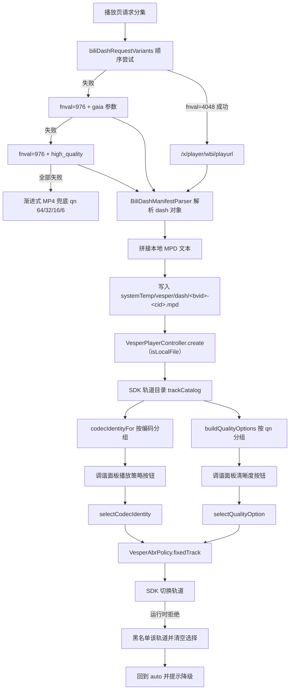

# 播放清晰度与 HDR 链路

清晰度选择从 Bilibili 的 `qn` 出发，经过本地生成的 DASH MPD 与 SDK 轨道目录，最终落到
一条被锁定或由 ABR 决定的视频轨道。HDR 与杜比视界的解码由平台播放器承担；应用层的
现状是「能解码、不能表达」——画质标签与轨道分组把 HDR/DV 当作普通清晰度处理，SDK 已经
提供的 HDR 元数据与能力探测结果没有任何消费方。

## 1. 术语

| 术语 | 含义 | 来源 |
| --- | --- | --- |
| 质量 ID（`qn`） | Bilibili 清晰度枚举，取值 6–127 | `bili_models.dart:902-936` |
| 编码 ID（`codecid`） | 7 = AVC，12 = HEVC，13 = AV1 | 见 §2.2 |
| 轨道 ID | SDK 侧声明的轨道标识，本应用自行构造 | `bili_dash_manifest_parser.dart:192-217` |
| 展示 label | 面向用户的清晰度文案 | `support_formats` 优先，`biliQualityLabelForId` 兜底 |
| 策略身份 | 编码分组的内部键，与展示 label 可以不同 | `bili_quality_mapping.dart:100-108` |

## 2. 质量 ID 与编码 ID

### 2.1 质量 ID

`biliQualityLabelForId`（`lib/bili/common/models/bili_models.dart:902-918`）与
`biliQualityRank`（`:920-936`）是唯一真相源：

| `qn` | label | rank |
| --- | --- | --- |
| 127 | 8K 超高清 | 1200 |
| 126 | 杜比视界 | 1190 |
| 125 | HDR 真彩 | 1180 |
| 120 | 4K 超清 | 1100 |
| 116 | 1080P60 | 1000 |
| 112 | 1080P 高码率 | 990 |
| 80 | 1080P | 900 |
| 74 | 720P60 | 800 |
| 64 | 720P | 700 |
| 32 | 480P | 600 |
| 16 | 360P | 500 |
| 6 | 240P | 400 |

`rank` 决定调谐面板中清晰度按钮的排列顺序，与 `qn` 数值大小不一致：126 排在 125 之前、
125 排在 120 之前。UI 不得直接按 `qn` 数值排序。

### 2.2 编码 ID

编码 ID 没有具名常量，只以两处内联分支存在：

- `bili_quality_mapping.dart:36-40` 把轨道 ID 中的编码段映射为文案（13→AV1、12→HEVC、7→AVC）；
- `bili_client_download.dart:481-492` 用它做离线缓存下载的编码偏好匹配。

杜比视界没有独立的编码 ID。它以 codec 字符串识别：`dvh1` 或 `dvhe` 前缀判定为 Dolby Vision
（`bili_quality_mapping.dart:22-24`），编码族为 `dolby-vision`（`:262-263`）。服务端在
`qn=126` 的视频流上给出的 `codecid` 是 `12`，与 HEVC 相同，因此**不能**用 `codecid` 区分
杜比视界与普通 HEVC，只能用 codec 字符串。

## 3. 端到端链路



## 4. 各阶段

### 4.1 playurl 请求

请求变体定义在 `lib/bili/common/services/bili_dash_api.dart:4-30`，共享参数在 `:32-51`：

| 参数 | 值 |
| --- | --- |
| `avid` / `bvid` / `cid` | 当前分集 |
| `qn` | `biliMaxVideoQuality`（127） |
| `otype` | `json` |
| `fnver` | 0 |
| `fnval` | 4048，失败降 976 |
| `fourk` | 1 |
| `support_multi_audio` | `true` |
| `session` | `BiliTransport.buildSessionValue()` |

首次请求附 `gaia_source=pre-load`、`isGaiaAvoided=true`、`from_client=BROWSER`、
`web_location=1315873`；最后一次尝试改为 `high_quality=1`。请求走 WBI 签名
（`useWbi: true`）。DASH 只在 Android 与 iOS 上尝试
（`bili_client_playback.dart:107-109`）。

`qn=127` 是请求上限，服务端按账号权限返回可用集合；实际可选项由响应的 `dash.video`
与 `support_formats` 决定，客户端不做权限预判。

### 4.2 解析

`BiliDashManifestParser` 把 `dash` 对象转为 `BiliDashStream`：

- 视频流取 `dash.video`；
- 音频流是三个列表的并集：`dash.audio`、`dash.flac`、`dash.dolby`
  （`bili_dash_manifest_parser.dart:20-24`），其中 `dolby` 支持数组与单对象两种形态；
- 解析成功要求视频与音频都非空（`:57`），只有视频流时整体判失败并回退渐进式 MP4；
- 清晰度 label 从 `support_formats` 取，优先级 `new_description` → `display_desc` →
  `description` → `format`（`:87-105`），缺失时回退 `biliQualityLabelForId`；
- 轨道 ID 形如 `<video|audio>-<qualityId>-<codecid 或 codecs 的字母数字>带宽-<序号>`
  （`:192-217`），例如 `video-80-7-1200000-0`。

### 4.3 本地 MPD

`BiliDashManifestBuilder` 生成静态 MPD（`bili_dash_manifest_builder.dart`）：

| 元素 | 内容 |
| --- | --- |
| `MPD` | `type="static"`，`profiles="urn:mpeg:dash:profile:isoff-on-demand:2011"` |
| Video AdaptationSet | `id="0"`，`contentType="video"`，`mimeType="video/mp4"` |
| Audio AdaptationSet | `id="1"`，`contentType="audio"`，`mimeType="audio/mp4"`，`lang="und"` |
| Representation 属性 | `id`、`bandwidth`、`codecs`，可选 `width`、`height`、`frameRate`、`audioSamplingRate`、`startWithSAP` |
| 地址 | 每个候选 URL 一个 `<BaseURL>`，主地址在前 |
| 分段 | `<SegmentBase indexRange>` + `<Initialization range>` |

MPD 中**没有** `SupplementalProperty`、`EssentialProperty`、`ContentProtection`，也没有
色彩基色、传递函数、亮度或杜比视界相关的描述符。HDR/DV 的识别信息只存在于 `codecs`
字符串里（如 `dvh1.05.06`）与 `codecId` 中。

### 4.4 轨道声明

适配器把解析结果转成 SDK 轨道（`bili_client_playback.dart:130-146`），只填
`id`、`kind`、`label`、`codec`、`bitRate`、`width`、`height`、`frameRate`。
`VesperMediaTrack` 没有 HDR 字段，HDR 信息不随轨道声明传递。

### 4.5 轨道 → 清晰度与编码

`BiliQualityMapping.qualityIdForTrack` 三路回退（`bili_quality_mapping.dart:13-18`）：

1. 轨道 ID 正则提取 `qn`；
2. 轨道 label 子串匹配（`杜比视界`/`dolby vision`→126，含 `hdr`→125，`8k`→127，
   `4k`/`2160`→120，`1080`+`60`→116，`1080`+`高码率`→112，`1080`→80，`720`+`60`→74，
   `720`→64，`480`→32，`360`→16，`240`→6）；
3. 按画面形状推断（高度 ≥4320→127，≥2160→120，≥1080→帧率 ≥50 取 116 否则 80，依此类推）。

编码分组的关键行为（`:100-108`）：

```dart
static String? codecIdentityForTrack(VesperMediaTrack track) {
  final label = codecLabelForTrack(track);
  return switch (label) {
    'Dolby Vision' => 'HEVC',
    _ => label,
  };
}
```

杜比视界轨道的展示 label 是 `Dolby Vision`，策略身份是 `HEVC`。适配器同时声明
`codecIdentityLabelFor: (identity) => identity`（`:110-119`），因此「播放策略」按钮上的
分组标签是 `HEVC`，杜比视界轨道不会产生独立按钮。

原生轨道反向映射到声明的清晰度选项时使用打分匹配
（`qualityOptionIdForNativeTrack`，`:121-245`）：编码族不一致直接拒绝，宽高不等直接拒绝，
帧率差超过 1 拒绝，label 推出的 `qn` 冲突拒绝，证据分低于 3 拒绝。编码族来自
`_codecFamily`，`dvh1`/`dvhe` 归为 `dolby-vision`，所以杜比视界的原生轨道只会匹配到
杜比视界的声明轨道。

### 4.6 选择

用户选择不直接调用轨道选择接口，而是转成 ABR 策略
（`media_playback_view_model_tracks.dart:4-61`）：

| 条件 | 动作 |
| --- | --- |
| 清晰度与编码都为空 | `VesperAbrPolicy.auto()` |
| 找到目标轨道且支持定轨 | `VesperAbrPolicy.fixedTrack(trackId)`，带 `expectedCatalogRevision` |
| 不支持定轨但支持码率约束 | `VesperAbrPolicy.constrained(maxBitRate: 轨道码率)` |
| 两者都不支持 | 返回「当前播放内核不支持切换到该清晰度。」 |

`setVideoTrackSelection` 在代理控制器上存在（`seek_aware_player_controller.dart:103-105`），
在 `lib/` 中没有调用方。

首次播放固定为 auto。控制器创建时只应用音频语言与字幕偏好
（`player_options.dart:17-21`），不应用清晰度。切换分集与重载会重置清晰度与编码选择
（`media_playback_view_model.dart:385-388`），只有进入/退出听视频模式时会被保存并还原
（`media_playback_view_model_listen.dart:3-13`、`:265-302`）。选择结果不跨会话持久化。

### 4.7 可用性判定与降级

`_trackSelectionAvailability`（`media_playback_view_model_tracks.dart:157-236`）把每个
清晰度选项归为四态，界面文案见 `media_playback_view_model.dart:662-695`：

| 态 | 触发 | 按钮 | 文案 |
| --- | --- | --- | --- |
| available | 存在 `supported` 的原生轨道 | 可用 | — |
| unknown | 只有 `unknown` 轨道 | 可用 | 「兼容性未知」 |
| unavailable | 无候选轨道或全部被拒 | 禁用 | 「当前清晰度无此编码」/「清晰度暂不可用」/「当前设备不支持」 |
| runtimeFailure | 本次播放中被运行时拒绝 | 禁用 | 「本次播放已自动降级」 |

运行时拒绝的处理（`media_playback_view_model_recovery.dart:51-98`）：把轨道 ID 加入
`_runtimeRejectedVideoTrackIds`，清空清晰度与编码选择回到 auto，待实际生效轨道变化后
提示一次「当前设备无法继续播放所选清晰度，已切换至 …」。

### 4.8 界面呈现

调谐面板（`media_playback_tuning_panel.dart`）依次是：播放设置、分辨率、播放策略、倍速、
字幕、离线缓存、会话信息。分辨率按钮直接使用平台 label，因此「杜比视界」与「HDR 真彩」
与其他清晰度按钮外观一致，没有额外标识。播放策略按钮只在适配器声明
`supportsCodecSelection` 时出现。

横屏画质按钮由 SDK stage 提供，显示 `自动 · 2160p` 形态的文案
（`vesper_player_ui` 的 `qualityButtonLabel`），点击后由应用接管并打开同一个调谐面板
（`media_playback_page_surfaces.dart:355-375`）。TV 调谐面板列出清晰度与降级文案，没有
编码子选项。

## 5. HDR 与杜比视界现状

### 5.1 解码

HDR 与杜比视界的解码由平台播放器承担：Android 走 MediaCodec 与系统 DV 解码器，iOS 走
AVPlayer。应用层不做任何 HDR 处理即可播放，实测真机上 `qn=126`/`125` 可正常出画面。
解码链路的可用性由设备决定，不由本应用决定。

由此可以推论：`qn=126`/`125` 出现在可选清晰度中，说明 SDK 的轨道能力判定认为该轨道
`supported`；若设备不支持，轨道的 `VesperTrackSupport.status` 会是
`exceedsCapabilities` 或 `unsupported`，按钮进入禁用态并给出 §4.7 的降级文案。

### 5.2 应用层缺口

| 缺口 | 现状 | 影响 |
| --- | --- | --- |
| 无 HDR/DV 标识 | 分辨率按钮只显示文案，「杜比视界」「HDR 真彩」与其他档位外观相同 | 用户在播放中无法确认当前是否真的走在 HDR 链路上 |
| 杜比视界归入 HEVC | `codecIdentityForTrack` 把 DV 折进 HEVC | 「播放策略」按钮看不出 DV，也无法单独选择 DV 与普通 HEVC |
| 能力探测未使用 | `probeAssociatedPlaybackCapability` 有透传无调用方 | 无法在播放前预判设备是否支持 DV/HDR，只能靠轨道 `support` 事后判定 |
| HDR 元数据未消费 | `VesperHdrMetadata` 全字段无读取方 | 无法展示亮度、色域、DV profile 等信息，诊断缺少 HDR 证据 |
| 能力告警忽略 HDR 字段 | 告警处理只读 `diagnostics['code']` 与 `trackId`（`media_playback_view_model_recovery.dart:51-78`） | 收到 `hdrNativeFrameUnsupported` 时不区分 HDR 与普通轨道问题 |
| 会话信息无 HDR 行 | 会话信息显示播放状态、时间线、当前链路、资源地址、Manifest、实际轨道 | 出问题时无法从界面确认实际渲染格式 |
| 选择不持久化 | 清晰度与编码只在内存 | 每次进入播放页都要重选 |

### 5.3 SDK 已提供但未消费的能力

| 能力 | 位置 | 内容 |
| --- | --- | --- |
| 能力探测 | `probeAssociatedPlaybackCapability`（`seek_aware_player_controller.dart:46-49`） | 返回 `status`、`codecFamily`、`hardwareDecodeSupported`、`outputFormat`、`hdrKind`、`dolbyVisionMode`、`confidence`、`hdrMetadata`、`missingCapabilities` |
| HDR 种类 | `VesperPlaybackCapabilityHdrKind` | `none` / `hdr10` / `hlg` / `dolbyVision` / `unknown` |
| 杜比视界模式 | `VesperPlaybackCapabilityDolbyVisionMode` | `none` / `fullChainCandidate` / `compatibleBaseLayer` / `unsupported` |
| 探测置信度 | `VesperPlaybackCapabilityConfidence` | `codecOnly` / `sourceMetadata` / `sessionProbe` |
| HDR 元数据 | `VesperHdrMetadata` | `colorPrimaries`、`transferFunction`、`lumaBitDepth`、`maxContentLightLevelNits`、`masteringDisplayMaxLuminanceNits`、`dolbyVisionProfile`、`dolbyVisionBaseLayer`、`dolbyVisionCompatibility` 等 |
| 输出格式 | `VesperPlaybackCapabilityOutputFormat` | `nv12` / `p010` / `surfaceOpaque` / `unknown`；`p010` 表示 10 bit 输出通路 |
| 告警原因 | `VesperCapabilityWarningReason` | `hdrNativeFrameUnsupported` |

Android 插件已经把这些字段映射到通道消息
（`vesper_player_android` 的 `VesperPlayerAndroidOutputMapping.kt:239-380`、
`VesperPlayerAndroidCapabilityProbeEvidence.kt`），应用侧是唯一的空环。

### 5.4 可选改进方向

| 方向 | 依赖 | 落点 |
| --- | --- | --- |
| 分辨率按钮增加 HDR/DV 角标 | 无，纯 UI | `media_playback_tuning_panel.dart` 的 `TuningOptionButton` |
| 杜比视界独立成组 | 修改 `codecIdentityForTrack`，让 DV 不再折进 HEVC | `bili_quality_mapping.dart:100-108` |
| 会话信息增加 HDR 行 | 消费轨道 `codec` 或探测结果 | 调谐面板会话信息段 |
| 播放前预判设备能力 | 调用 `probeAssociatedPlaybackCapability` | 播放页控制器创建流程 |
| HDR 告警单独归类 | 读取告警的 `hdrKind` 与 `recommendedPlaybackPath` | `media_playback_view_model_recovery.dart:51-78` |
| 清晰度与编码跨会话记忆 | 新增持久化，参照 `AppSettingsStore` | `media_playback_view_model.dart` 的两个 selection 信号 |

改动杜比视界分组前需要确认既有测试的意图：`test/media_contract_test.dart:164-176`
断言 `codecLabelFor` 返回 `Dolby Vision` 而 `codecStrategyIdentityFor` 返回 `HEVC`，
`test/media_playback_shell_test.dart:999-1040` 断言身份键不泄漏到界面。这两条约束是
「展示与身份分离」的设计，拆分 DV 分组需要同时更新它们。

## 6. 不变量

- 清晰度排序只由 `biliQualityRank` 决定，与 `qn` 数值无关；
- 杜比视界不能通过 `codecid` 区分，只能通过 codec 字符串的 `dvh1`/`dvhe` 前缀；
- 轨道 ID 由本应用构造，解析方不得假设 SDK 会保留同一形状；
- 视频轨道选择统一走 ABR 策略，`setVideoTrackSelection` 不用于视频；
- 会话切换、分集切换、运行时拒绝都会清空清晰度与编码选择，回到 auto；
- 未识别的 codec 字符串不得被当作可选项展示，宁可回退到按画面形状推断；
- MPD 只描述传输所需字段，HDR 描述符不写入 MPD。

## 7. 回归入口

- `test/media_contract_test.dart:145-227`：适配器能力声明、DV 展示与身份分离、原生轨道按
  语义与码率匹配同尺寸清晰度。
- `test/bili_playback_view_model_test.dart:85-169`：标签映射、编码偏好默认值、轨道到
  `qn` 的三路回退（ID、label、形状）。
- `test/bili_services_test.dart:639-1105`：MPD 构造（时长、AdaptationSet、BaseURL、
  SegmentBase）、重复清晰度的 Representation ID、备份地址、纯音频 MPD 省略视频
  AdaptationSet、`dash.dolby`/`dash.flac` 合并、杜比视界轨道保留。
- `test/shared_service_contracts_test.dart:108-179`：播放与下载共用的请求参数、label 策略
  差异、资源 ID 中的编码 token。
- `test/media_playback_view_model_test.dart:54-91`：清晰度选项来源与无控制器时的空操作。
- `test/media_playback_shell_test.dart:999-1680`：编码身份不泄漏、定轨过期错误文案、
  运行时拒绝后只对账一次。
