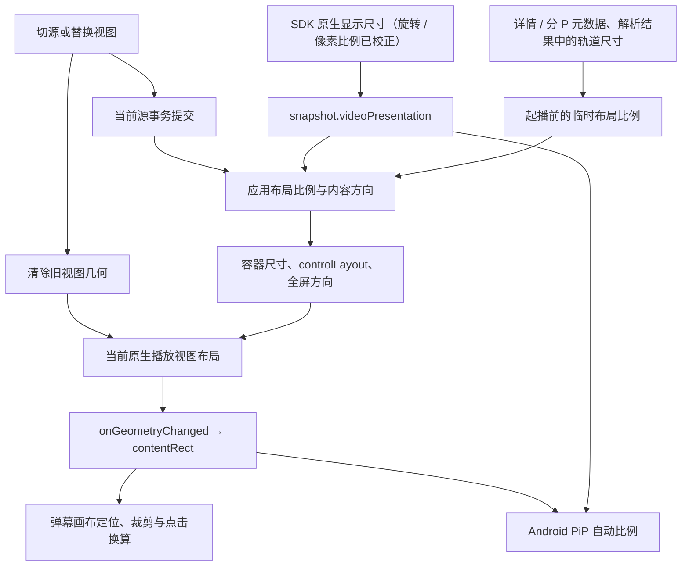

# 竖屏视频播放

依赖基线为 Vesper SDK **0.6.2**，包括 hosted Flutter packages、Android 性能诊断制品和
iOS SwiftPM 的 `VesperPlayerKit`。0.6.0 引入显示尺寸、视图几何与独立控件布局契约，
0.6.2 包含后续 PiP 与原生视图切换修复。Flutter 最低要求为 3.47.2。

应用决定播放容器、控件密度、全屏方向和弹幕布局。SDK 负责原生等比呈现，并分别报告
媒体显示尺寸和当前视图中的实际画面矩形。手机播放页已按内容比例布局、按内容方向进入
全屏；手机与 TV 的弹幕画布均使用当前视图的实际画面矩形。

## 1. SDK 契约与运行链路

| 能力 | 0.6.2 出口与语义 |
| --- | --- |
| 显示尺寸 | `snapshot.videoPresentation.displayWidth/displayHeight/displayAspectRatio`；已校正旋转和像素宽高比，未知时 `videoPresentation == null` |
| 实际画面矩形 | `VesperPlayerStage.onGeometryChanged` / `VesperPlayerView.onGeometryChanged` 返回 `VesperVideoSurfaceGeometry?`；`contentRect` 排除渲染器添加的黑边 |
| 控件密度 | 必填 `controlLayout: VesperStageControlLayout.compact/expanded` |
| 全屏状态 | 独立必填 `isFullscreen`；驱动全屏按钮图标与文案，不设置系统方向 |
| 扩展控制栏插槽 | `expandedControlBarLeading`，替代 `landscapeControlBarLeading` |
| 内容点击 | `onContentTap` 提供完整 Stage 坐标；返回 `true` 消费确认后的单击 |
| PiP 比例 | Android 优先采用显式比例，其次原生显示比例；iOS 由 AVPlayerLayer 的媒体呈现决定 |

Android 的 SurfaceView / TextureView 使用 aspect fit，iOS 的 AVPlayerLayer 使用
`resizeAspect`。因此，容器比例可以与视频不同；弹幕定位依据 `contentRect`。
该契约适用于移动端系统播放路径，不代表实验性 native-frame 路径具有相同保证。

`videoPresentation` 是媒体状态，可以跨视图保留。`VesperVideoSurfaceGeometry` 是单个
播放视图的状态，不在 snapshot 中。Flutter 坐标单位为逻辑像素，原点为当前 Stage / View
左上角；`width/height` 是整个视图尺寸，`contentRect` 是其中的画面区域。

切源清除旧媒体尺寸与几何；视图脱离清除几何，已知媒体尺寸可以保留；停止已加载源保留
已知尺寸。几何为 `null` 表示未知、尚未布局或已脱离。SDK 不会用 16:9 伪造未知矩形。
Flutter 视图 dispose 后不再调用宿主回调，宿主移除视图时需自行丢弃缓存的几何。

## 2. 宽高比数据源

### 2.1 运行时真值与起播前回退

| 顺序 | 来源 | 用途与边界 |
| --- | --- | --- |
| 1 | 当前源的 `snapshot.videoPresentation` | 运行时布局真值，使用 `displayAspectRatio`，包含旋转与像素比例校正 |
| 2 | 当前源的有效视频轨道尺寸 | 按 `effectiveVideoTrackId` 匹配；未命中时，原生视频目录中的有效尺寸比例须一致 |
| 3 | `ResolvedMediaPlayback.videoTracks` | 原生尺寸未知时的声明回退；有效候选比例须一致 |
| 4 | 当前分 P / 详情的 `dimension` | 经 `BiliMediaMapper` 映射为 `declaredAspectRatio`，详情提示仅用于首 P |
| 5 | 应用的 16:9 占位比例 | 尺寸未知时维持横屏布局回退，不作为已确认的媒体尺寸 |

解析阶段的 `videoTracks` 来自 `bili_client_playback.dart` 的 `_buildDashVideoTracks`，
由 DASH 响应构造。它们保存在解析结果中；SDK 的 `snapshot.trackCatalog` 由原生源加载
产生，并不保证在应用刚解析完 MPD 时就存在。多个候选轨道比例不一致且无法确定当前轨道
时，声明尺寸保持未知，避免任意取第一条。

`videoVariantObservation.width/height` 保留为在播编码变体的观测信息，不能覆盖已校正的
`videoPresentation`。声明尺寸也可能缺少旋转和像素比例信息，只用于原生尺寸到达前的
临时布局。清晰度切换仅改变分辨率、未改变显示比例时，不需要重排容器。

`BiliVideoDetail`、`BiliVideoPageEntry` 已分别承接顶层 `dimension` 与 `pages[].dimension`。
`BiliVideoDimension.displayAspectRatio` 校正 90/270 度旋转；`BiliMediaMapper` 将该提示
传入平台无关的 `MediaDetail` / `MediaPlaybackEntry.declaredAspectRatio`。原始宽、高、
旋转保存在 `platformExtras['dimension']` 的 JSON 兼容 map 中，支持反向映射和持久化。

`resolveMediaVideoAspectRatio` 集中解析上述优先级。`MediaPlaybackViewModel.videoAspectRatio`
通过 signal 提供已提交源的布局比例；目标条目无尺寸时，仅首 P 可以使用详情提示。
缺失、非正数和非有限比例按未知处理，其他分 P 不继承首 P 尺寸。

### 2.2 方向分类

已知有效显示尺寸时，`displayWidth < displayHeight` 为竖向内容，其余为横向或方形内容。
起播前可按声明尺寸做临时分类；未知时回退横向。分类只决定布局策略，画面比例仍使用
实际的 `width / height`，不把所有横向内容统一改为 16:9。

## 3. 当前应用接入状态

| 应用入口 | 当前行为 |
| --- | --- |
| `lib/media/models/media_video_layout.dart` | 统一解析原生显示尺寸、有效轨道、声明轨道、条目提示与默认比例 |
| `lib/media/playback/media_playback_page_surfaces.dart` 的 `_buildStage` | 独立传入控件密度与真实全屏状态，接入几何及确认单击；紧凑顶栏保留弹幕和小窗，次要操作进入播放设置 |
| 同文件的 `_buildStageFrame` | Stage 填满安全区和边距内的容器，由原生播放器等比呈现 |
| `lib/media/playback/media_playback_page_phone.dart` | 内嵌高度按比例计算并限制在页面高度的 70%；全屏填满安全区；Android PiP 只保留填满窗口的视频；宽屏仍使用播放区与详情并排布局 |
| `lib/media/playback/media_video_content.dart` | 每个挂载视图独立保存几何，定位与裁剪弹幕，并转换点击坐标 |
| `lib/media/playback/seek_aware_player_controller.dart` | 转发 SDK 的逐视图几何流，保留控制器代理的用户 seek 追踪 |
| `lib/bili/common/pages/bili_playback_page.dart` 的 `_buildPresentation` | 根据内容方向进入全屏，退出全屏恢复手机播放页的竖屏策略 |
| `lib/media/playback/media_playback_page.dart` 的 `_syncPictureInPictureConfiguration` | 手机视频模式启用 `enabled/autoEnter`，比例由 SDK 自动推断 |
| `lib/media/playback/media_playback_page_tv.dart` | TV 保持横屏容器与遥控控制栏；`VesperPlayerView` 的几何驱动弹幕布局 |
| `lib/bili/app_mode/pages/bili_hub_common.dart` | `_HomeVideoItem.fromFeed/fromSearch` 的 `vertical` 仍为 `false` |

## 4. 布局与交互

### 4.1 容器与控件

手机内嵌播放区按有效显示比例计算理想高度，并为简介与评论保留至少 30% 的页面高度。
高度受限时画面等比缩小和居中，弹幕使用实际 `contentRect`。全屏容器覆盖屏幕安全区，无需强制
把整个 Stage 压成与视频相同比例。安全区由应用安排，SDK Stage 不接管系统方向与安全区。

控件密度根据可用空间与交互需求选择。手机内嵌始终使用 `compact`；全屏可用宽度小于
600 或宽小于高时使用 `compact`，其余使用 `expanded`。`isFullscreen` 始终传真实
全屏状态，紧凑全屏也展示退出全屏图标。竖向视频出现在宽屏容器中，不会
自动要求紧凑控件。TV 保持横屏容器并等比居中显示竖向内容。

SDK 会在尺寸、`controlLayout` 或 `isFullscreen` 变化时取消未完成的拖动 seek，并恢复
长按临时倍速。应用布局切换需保留这一交互语义。

紧凑顶栏的应用快捷操作仅保留弹幕开关与小窗，避免多个图标挤压标题和「点播视频」标签。
听视频、投屏与性能诊断在「更多 → 播放设置」中提供带文字的入口；全屏中不显示听视频。
设置面板先关闭，再打开目标模式或弹层。展开布局保留投屏和诊断快捷入口，iOS 的设置入口
继续使用原生 AirPlay 设备选择器。

### 4.2 全屏方向

`BiliPlaybackPage._buildPresentation` 的全屏回调根据当前提交源的内容方向，选择
`biliPortraitOrientations` 或 `biliLandscapeOrientations`。竖向内容进入竖屏沉浸模式，
横向内容进入横屏沉浸模式；全屏期间切换到相反方向的分 P，在新源提交后重新应用方向。
退出全屏恢复手机播放页方向。系统呈现请求按序执行，尚未开始的旧请求被新请求替代；
退出操作先更新全屏状态，防止迟到尺寸再次发起进入全屏，页面销毁后最后恢复应用呈现。

当前 `_buildPresentation` 在手机播放页内显式请求竖屏；`resolveBiliAppPreferredOrientations`
读取系统自动旋转开关的策略用于恢复应用呈现。不能据此推断现有非全屏播放页已遵循系统
自动旋转。播放页方向策略的调整属于应用职责。

### 4.3 画面矩形与弹幕

`MediaVideoContent` 为当前挂载视图保存 `VesperVideoSurfaceGeometry?`，通过 Stage / View
的 `onGeometryChanged` 接收更新。在完整 Stage 大小的 `contentOverlay` 中，以
`contentRect.left/top` 定位，以 `contentRect.width/height` 约束弹幕画布，并裁剪到该矩形。
SDK 的 `contentOverlay` 默认只裁剪到整个 Stage，不会自动排除视频黑边。

几何未知或失效时，弹幕会话继续挂载以提供发送能力，但画布处于 Offstage、关闭绘制和
Ticker，不参与命中。源事务进行中暂停画布；SDK 的 `null` 回调清除旧几何，新源几何可在
事务完成前接收，在提交后启用。伴听和 PiP 不启用视频弹幕交互。

视图尺寸变化后，只有与当前 Flutter 容器尺寸匹配的几何才可使用，允许一个物理像素的
舍入误差。全屏切换、折叠后重新挂载、控制器替换和页面退出会销毁原视图的几何状态。
旧视图的回调不能修改新视图，即使两个视图共用同一控制器。片源编码进去的黑边仍属于
画面，`contentRect` 无法排除。

内容点击通过 `onContentTap` 接入：先用 `contentRect.contains(x, y)` 排除渲染器黑边，
再减去 `left/top` 转为弹幕画布的逻辑像素坐标，交给 `MediaDanmakuInteractionController`。
暂停时命中可见普通弹幕后返回 `true`，其余返回 `false` 交给 Stage。
`contentOverlay` 内部禁用指针输入，不能仅靠子组件的
点击监听接收手势；控件和底部保留区仍优先于内容点击，PiP 时内容交互关闭。

车道数由弹幕画布高度计算，竖屏下可继续使用现有预算。当前滚动弹幕使用固定穿越时长，
速度按画布宽度和文本宽度计算；画布变窄不会自动缩短穿越时间。高密度车道预算是否需要
调整，由竖屏性能和遮挡实测决定。

mode 7 高级弹幕的整数坐标和路径仍按 672×438 参考画布转换。解析器没有把所有坐标限制
到 0–1，越界绘制依靠画布裁剪；不能假定归一化后一定不越界。竖屏发送端协议未确认前，
保留现有坐标解释，映射目标改为实际画面区域。

### 4.4 PiP

Android Flutter 插件的比例优先级为：

1. 有效的显式 `preferredAspectRatio`；
2. `controller.videoPresentation.displayAspectRatio`；
3. viewport 比例；
4. host view 比例；
5. 16:9 回退。

默认保留 `preferredAspectRatio == null` 即可使用原生显示比例。SDK 在媒体、视图几何和
viewport 变化时刷新手动及自动进入参数，已知 `contentRect` 还用于进入动画的源矩形。
9:16 在 Android 允许区间内，超出系统区间的比例由 SDK 限制并安全转换为有理数。

Android 会把整个 Activity 缩入 PiP。应用收到 `entering` 或活动状态后，以 signal 切换到
仅含视频的布局，移除详情、评论、页面边距和安全区留白；Stage 隐藏控件与弹幕。进入前的
全屏状态保留，返回或进入失败后恢复原布局，不重建播放器会话或重新起播。

如需在原生尺寸未知时使用声明尺寸作为提前进入 PiP 的提示，应用必须随源切换更新提示，
并在原生显示尺寸到达后通过新配置清除该提示，避免旧值持续覆盖原生比例。不能把容器
比例或 16:9 占位值固定写入配置。

iOS PiP 使用 AVPlayerLayer 的媒体呈现，`preferredAspectRatio` 是 Android 提示，不能
用于指定 iOS 窗口尺寸。0.6.2 修复 Flutter iOS 自动进入配置同步，以及退出、更换视图或
销毁会话后仍执行待处理 PiP 请求的问题。TV 与听视频模式继续禁用自动 PiP。

### 4.5 多 P 切换与迟到尺寸

`MediaPlaybackViewModel.switchEntry` 使用 `_sourceTransitionGeneration` 和源事务
串行化完成切源。事务进行中保留原容器比例以减少跳动，但旧几何在 SDK 通知失效时
立即清除。事务成功后使用目标源的显示尺寸或声明回退；失败回滚后重新等待恢复视图的
几何，不能复用旧矩形。

原生 `videoPresentation` 可能在事务提交后才到达。当前源的后续有效显示比例变化需要
更新布局，不能把重算限制为「仅事务完成时一次」。源代际与视图生命周期分别约束媒体
比例和画面矩形，旧请求、旧源以及旧视图的更新不能覆盖当前状态。

### 4.6 列表与 feed

feed/search 模型尚未提供可靠的维度信息，`_HomeVideoItem.vertical` 保持 `false`。
详情的 `dimension` 不代表列表接口也提供同样字段。
本阶段列表、收藏与离线页封面继续采用既有卡片比例。

## 5. 约束

- 运行时内容方向与比例以当前源的 `videoPresentation` 为准，声明尺寸仅作临时回退。
- 容器可以包含黑边；弹幕绘制和命中统一使用当前视图的 `contentRect`。
- `controlLayout` 表示控件密度，`isFullscreen` 表示全屏状态，两者独立。
- 手机竖向内容的全屏策略保持竖屏；TV 维持横屏容器。
- SDK 几何未知时保留未知状态，不把应用占位布局写成真实画面矩形。
- PiP 默认使用 SDK 动态比例；显式提示不能跨源保留过期值。
- 源事务可稳定容器尺寸，但不阻止几何失效或当前源迟到尺寸的校正。

## 6. 验证入口

SDK 升级兼容性已通过移动端原生构建。应用 UI 的静态与回归入口为 `flutter analyze`
和 `flutter test`，竖屏接入有以下自动化覆盖：

- `test/media_video_layout_test.dart`：旋转和像素比例校正后的原生尺寸优先，有效轨道匹配、
  候选轨道比例冲突、非法与未知尺寸回退。
- `test/media_contract_test.dart`：Bili 尺寸到通用提示的映射、旋转信息往返与 extras 的 JSON 兼容性。
- `test/media_playback_shell_test.dart`：内嵌高度上限、迟到尺寸校正、首 P 提示隔离、
  紧凑与展开全屏、退出图标、安全区、方向请求串行化、多 P 提交与失败回滚、视图替换、
  SDK 确认单击与双击、TV 画面区域、紧凑顶栏标题空间与次要操作、默认 PiP 不固定比例，
  以及 Android PiP 独占视频布局、返回恢复全屏状态和进入失败回退。
- `test/media_video_content_test.dart`：pillarbox / letterbox 的画布位置和裁剪、黑边命中排除、
  几何未知与 `null`、尺寸变化、视图替换、源事务期间的绘制及命中行为。
- `test/media_danmaku_layer_test.dart`：既有弹幕过滤、会话切换、车道和动画行为。

### 6.1 Android 真机验收

2026-09-19 使用 NX733J（Android 16 / API 36，1216×2688）进行验收，使用 hosted
Vesper 0.6.2 和应用 `android/` 项目的 Gradle 9.7.1 wrapper 构建 debug APK。
最终构建已安装到设备；`flutter analyze` 无问题，`flutter test` 共 708 项通过。

| 素材 | 显示尺寸 | 覆盖路径 |
| --- | --- | --- |
| `BV1L1eS6sEqC`「舍友把宿舍改造成飞机」 | 1080×1920，旋转 0 | 竖向内嵌、竖屏全屏、弹幕画面内选中与黑边排除、听视频往返、手动与自动 PiP |
| `BV1Sve26eENf`「出大问题！房车抛锚！差点渴死在沙漠里！」 | 1920×1080，旋转 0 | 横向内嵌、横屏全屏及展开控件、退出恢复竖屏、横向 PiP |

系统窗口观测为竖向约 381×677、横向 677×381，分别接近 9:16 和 16:9。两类素材往返
播放时，小窗比例随媒体更新。内嵌与全屏进入 PiP 后仅显示视频，返回后恢复原布局。
暂停时点选可见弹幕可以打开对应操作面板，点击渲染器黑边不会打开弹幕操作。紧凑顶栏的
标题与类型标签正常显示，「更多」中的听视频入口及返回视频已完成真机验证。

验收中曾出现一次横屏全屏进入 PiP 后画面偏移、返回时无响应。系统记录为输入焦点事件
超时，调试器捕获的主线程停在 `FlutterJNI.nativeSurfaceChanged`，调用链来自
`FlutterSurfaceView.changeSurfaceSize`。重启后及最终构建的上述往返未再复现；尚未确认
根因，保留为原生渲染切换的待复现项。应用 PiP 布局修复解决的是详情栏进入小窗的问题，
不能据此认定该无响应问题已修复。

仍需独立设备或素材验收：带旋转元数据的视频、非方形像素素材、同一视频内多 P 横竖切换
与失败回滚、iOS PiP 自动进入开关及请求取消、TV 竖向视频居中。widget 测试中的原生尺寸
和几何由测试替身提供，不能替代这些原生路径的验收。

SDK 契约依据：
[Vesper 0.6.2 video presentation](https://github.com/umbrella22/Vesper/blob/v0.6.2/lib/flutter/vesper_player_platform_interface/doc/video-presentation.md)、
[Stage API](https://github.com/umbrella22/Vesper/blob/v0.6.2/lib/flutter/vesper_player_ui/lib/src/stage/vesper_player_stage.dart)、
[发布记录](https://github.com/umbrella22/Vesper/blob/v0.6.2/CHANGELOG.md)。
