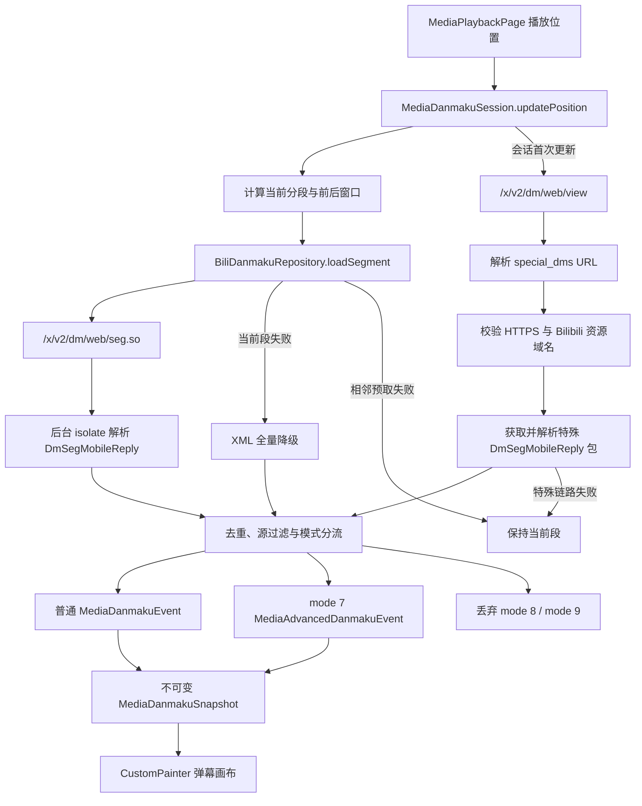

# Bilibili 弹幕与评论接口笔记

弹幕链路以播放位置驱动分段加载，将 Bilibili protobuf 数据转换为通用、不可变的
`MediaDanmakuSnapshot`。播放壳处理会话生命周期、持久化显示设置和渲染，不解释平台协议；
协议参数、解析、平台源过滤与降级集中在 `lib/danmaku/` 和
`lib/bili/common/services/`。

安全规则：mode 7 只解析声明式坐标、路径和样式；mode 8 代码与 mode 9 BAS 只分类并丢弃，
任何平台响应都不能向 Flutter 运行时注入可执行代码。

## 1. 能力边界

| 能力 | 手机 | TV | 状态 |
| --- | --- | --- | --- |
| 普通弹幕显示 | 支持 | 支持 | 滚动、顶部、底部、逆向和字幕通道 |
| mode 7 高级弹幕 | 支持 | 支持 | 安全声明式子集 |
| mode 8 代码弹幕 | 不执行 | 不执行 | 获取后分类并丢弃 |
| mode 9 BAS | 不支持 | 不支持 | 获取后分类并丢弃 |
| 弹幕设置 | 完整面板 | 简化面板 | 全局持久化，TV 使用遥控器预设 |
| 弹幕发送 | 不提供 | 不提供 | 后续阶段 |
| 弹幕点赞 | 不提供 | 不提供 | 后续阶段 |
| 评论浏览 | 支持 | 不提供 | 手机沿用现有评论面板 |
| 评论发送 | 支持 | 不提供 | 手机沿用现有评论面板 |
| 评论点赞 | 不提供 | 不提供 | 后续阶段 |

TV 播放页不创建评论面板、文本输入框、弹幕发送或点赞入口。弹幕能力未由平台 adapter
声明时，手机和 TV 均不挂载弹幕画布，也不显示开关或设置入口。

## 2. 运行链路



### 2.1 会话与分段

- `MediaDanmakuProvider.openSession` 为每个播放目标创建独立会话。
- 普通分段长度为 `360000ms`，索引从 1 开始：
  `segmentIndex = max(progressMs, 0) ~/ 360000 + 1`。
- 已知视频时长时，索引不会超过最后一个分段。
- 会话保留当前分段及相邻分段。窗口变化后，已离开窗口的数据立即淘汰。
- `_loadingSegments` 合并同一会话内的重复请求。
- 异步结果只在对应分段仍位于当前窗口时写入，seek 前发出的迟到响应不会污染新快照。
- 当前分段请求失败时，会话切换到 XML 全量数据；相邻预取失败不触发该降级。
- 特殊资源链路每个会话最多启动一次，失败不触发 XML 降级，也不隐藏普通分段。
- provider 或播放目标变化时，`MediaDanmakuLayer` 关闭旧会话并忽略旧代际事件。

### 2.2 普通分段传输与解析

```text
GET https://api.bilibili.com/x/v2/dm/web/seg.so
    ?type=1&oid={cid}&segment_index={n}&pid={aid}
```

| 参数 | 含义 |
| --- | --- |
| `type` | 视频弹幕固定为 1 |
| `oid` | 当前分集的 cid |
| `pid` | 当前分集的 aid；值大于 0 时发送 |
| `segment_index` | 1 起始的 360 秒分段索引 |

请求使用当前分集的 bvid 生成 Referer，并通过 `BiliTransport` 复用 cookie、WBI 签名、
超时和 352 风控恢复逻辑。`BiliHttpResponse` 保存原始 `bodyBytes`；JSON 调用按需读取
UTF-8 `body`，protobuf 不经过字符串转换。二进制端点返回 JSON 错误体时转换为
`BiliApiException`，不会交给 protobuf parser。

`BiliDanmakuSegmentParser` 读取 `DmSegMobileReply` 中用于分类、过滤和渲染的字段：

| protobuf 字段 | 应用字段 |
| --- | --- |
| `id` / `idStr` | `rowId`，用于缓存与跨段去重 |
| `progress` | `appearAtMs` |
| `mode` | 普通位置、mode 7、mode 8、mode 9 或未知模式 |
| `fontsize` | 通用字号比例 |
| `color` | 24 位 RGB |
| `midHash` | `senderHash`，用于平台源精确屏蔽 |
| `content` | UTF-8 文本或 mode 7 JSON 数组 |
| `weight` | 平台云屏蔽等级 |
| `pool` | 普通、字幕或特殊弹幕池 |

parser 支持未压缩和 gzip 数据，校验 wire type、长度和 UTF-8，并按 protobuf wire 规则
跳过未知的 varint、fixed32、fixed64 和 length-delimited 字段。缺失 dmid 时使用
`progress:mode:text` 生成稳定键。XML 降级解析同样在后台 isolate 执行，并保留 p 参数中的
sender hash。

### 2.3 View 与特殊资源

```text
GET https://api.bilibili.com/x/v2/dm/web/view
    ?type=1&oid={cid}&pid={aid}
```

`BiliDanmakuViewParser` 从 `DmWebViewReply` 读取状态、分段配置和 `special_dms` URL。
特殊资源仍按 `DmSegMobileReply` 解析，主要用于识别特殊池中的 mode 8 和 mode 9。

`BiliClient.fetchDanmakuSpecialResource` 只接受以下 URL：

- scheme 必须为 HTTPS；
- host 必须为 `bilibili.com`、`hdslb.com` 或其子域；
- URL 不得包含 user-info。

公开响应中存在 `i0.hdslb.com/bfs/dm/...bin`、`comment.bilibili.com` 和
`api.bilibili.com` 形态。特殊资源使用当前视频 Referer，但不携带 Cookie；拒绝或加载失败时
只记录 host 或异常类型，不记录可能带签名参数的完整 URL。

### 2.4 模式映射与过滤

- mode 1/2/3 映射为从右向左滚动。
- mode 4 映射为底部固定，mode 5 映射为顶部固定，mode 6 映射为逆向滚动。
- mode 7 通过 `BiliAdvancedDanmakuParser` 转换为独立的高级事件列表。
- mode 8、mode 9 和未知模式不生成任何渲染事件。
- pool 0 映射为普通弹幕；pool 1 映射为底部字幕通道。
- pool 2 的普通事件被过滤；其中 mode 8/9 只完成分类，不执行 payload。
- `weight < minimumWeight` 的条目在 Bilibili provider 层过滤。
- sender hash 使用大小写敏感的完整字符串匹配，不 trim、不转小写。
- 相同 `rowId` 在保留窗口内只生成一个事件。
- 普通事件与高级事件分别按 `timeMs`、`id` 排序，并封装为不可变列表。

## 3. 渲染与设置

`MediaDanmakuOverlay` 使用 `CustomPainter`，外层由 `RepaintBoundary` 隔离。Ticker 只通知
painter 重绘，不触发逐帧 `setState`，播放页和播放器控件不会随弹幕动画重建。

- 普通事件在创建 `TextPainter` 和分配车道前应用类型、彩色和关键词过滤。
- 高级事件使用独立文字缓存、活动窗口和路径计划，不占用普通弹幕车道。
- 活跃事件通过时间排序列表的二分起点查找，不逐帧扫描完整分段窗口。
- 滚动和逆向弹幕按文字宽度计算速度；车道同时检查入场间距和后续追尾时间。
- 顶部、底部弹幕使用固定显示时长与独立静态车道。
- 字幕通道固定在视频底部，不占用普通显示区域的底部车道。
- 没有安全车道时丢弃该条渲染计划，不延迟到错误的时间显示。
- 关闭弹幕时停止 ticker 并卸载画布。

### 3.1 mode 7 安全子集

`BiliAdvancedDanmakuParser` 只接受 JSON 数组。已支持字段如下：

| 数组索引 | 含义 |
| --- | --- |
| `[0]`, `[1]` | 起点坐标 |
| `[2]` | `alphaFrom-alphaTo` 或单值透明度 |
| `[3]` | 生存时间，秒 |
| `[4]` | 文本 |
| `[5]`, `[6]` | Z/Y 旋转角度 |
| `[7]`, `[8]` | 目标坐标 |
| `[9]`, `[10]` | 运动时长与延迟，毫秒 |
| `[14]` | 仅含 `M` / `L` 的线段路径 |

整数坐标按 `672x438` 绝对画布归一化，浮点坐标按相对值处理。路径坐标使用绝对画布；
相邻路径段按时间等分插值。生存时间必须大于 0 且不超过 12 秒，路径最多 256 个点；超出
预算或结构损坏时整条拒绝，不截断、不修复。Y 旋转只映射为声明式透视缩放，不创建脚本
或第三方运行时。

### 3.2 持久化设置

`DanmakuSettingsController` 在应用组合根创建，并通过 `DanmakuSettingsScope` 注入播放页。
设置先同步发布到三个 listenable，再写入 `vesper-app-settings.json`；写入失败且期间没有更新值时
回滚到前值。

`danmaku` 记录包含：

- 总开关、不透明度、同屏密度、字号和显示区域；
- 滚动、顶部、底部、逆向、字幕、高级和彩色开关；
- 关键词字面子串列表；
- `minimumWeight` 与 sender hash 精确屏蔽列表。

读取时只接受正确 JSON 类型和合法数值范围。关键词和 sender hash 保留大小写、空格及 Unicode；
空字符串不形成过滤规则。手机面板提供所有设置。TV 面板提供总开关、常用类型、显示区域、
不透明度、字号和密度预设；手机设置的关键词、sender hash 和云屏蔽等级仍会应用于 TV 播放。

## 4. 故障行为

| 故障 | 行为 |
| --- | --- |
| 播放目标缺少 bvid 或有效 cid | 发布空快照，不发网络请求 |
| 当前 protobuf 分段请求或解析失败 | 请求 XML 全量数据并切换本会话数据源 |
| 相邻分段预取失败 | 当前画面继续工作，进入该分段时可重新请求 |
| XML 降级也失败 | 快照保留错误且不渲染事件 |
| View、URL 校验或特殊包失败 | 保留普通分段，不触发 XML 降级 |
| mode 7 JSON 损坏或超出预算 | 丢弃该条高级弹幕 |
| mode 8、mode 9 payload | 丢弃，不解释和执行 |
| seek 期间旧请求完成 | 结果因不在当前窗口而丢弃 |
| provider/entry 被替换 | 关闭旧会话，代际检查拒绝旧快照 |
| 无可用弹幕车道 | 丢弃当前事件，保持帧率和时间语义 |
| 设置写入失败 | controller 在没有后续更新时回滚 |

## 5. 后续互动接口

以下弹幕接口尚未接入。实现发送或点赞前，需要定义登录态提示、乐观更新回滚、限频错误
文案和手机端交互；TV 不接入这些能力。

### 5.1 发送弹幕

```text
POST https://api.bilibili.com/x/v2/dm/post
Content-Type: application/x-www-form-urlencoded
```

主要字段为 `type=1`、`oid={cid}`、`pid={aid}`、`mode`、`progress`、`fontsize`、
`color`、`pool=0`、`rnd` 和 `msg`。请求需要登录 cookie、当前视频 Referer，以及
`csrf` / `csrf_token`。成功后可将服务端返回的 dmid 对应事件插入当前分段；失败时不改变
本地快照。

### 5.2 弹幕点赞

```text
POST https://api.bilibili.com/x/v2/dm/action
    dmid={rowId}&action=1|0&csrf={bili_jct}
```

点赞状态需要独立于渲染事件维护，避免一次互动导致整个分段重新布局。

### 5.3 评论点赞

```text
POST https://api.bilibili.com/x/v2/reply/action
    type=1&oid={aid}&rpid={commentId}&action=1|0&csrf={bili_jct}
```

响应不提供新的点赞数，客户端需要乐观更新并在失败时回滚。评论列表及楼中楼继续使用现有
`/x/v2/reply` 和 `/x/v2/reply/reply` 链路。

### 5.4 历史弹幕

`/x/v2/dm/web/history/seg.so` 按日期和分段返回历史弹幕，需要登录。历史模式可复用
`BiliDanmakuSegmentParser`，但缓存键还需加入日期，防止不同日期的同分段互相覆盖。

## 6. 回归入口与不变量

- `test/bili_danmaku_segment_parser_test.dart`：合成字节覆盖分段 protobuf、gzip 和损坏输入。
- `test/bili_danmaku_view_parser_test.dart`：合成字节覆盖 view、特殊 URL、未知字段和损坏输入。
- `test/bili_advanced_danmaku_parser_test.dart`：覆盖 mode 7 坐标、路径、样式、预算和拒绝策略。
- `test/bili_danmaku_transport_test.dart`：覆盖二进制传输、请求参数、CDN 白名单和特殊包解析。
- `test/bili_danmaku_provider_test.dart`：覆盖分段窗口、特殊链路、模式分流、动态过滤和 XML 降级。
- `test/media_danmaku_layer_test.dart`：覆盖全部显示过滤、车道计划和高级路径插值。
- `test/danmaku_settings_test.dart`：覆盖持久化、非法值回退、原字符串保真和手机面板。
- `test/media_playback_shell_test.dart`：覆盖手机/TV 开关、TV 简化面板、遥控焦点和无评论入口。

回归数据在测试内存中构造，不保存生产响应。协议模型不进入播放壳；平台请求不进入 painter；
事件列表保持不可变；旧会话与窗口外响应不能改变当前画面；mode 8/9 不得获得执行分支。
